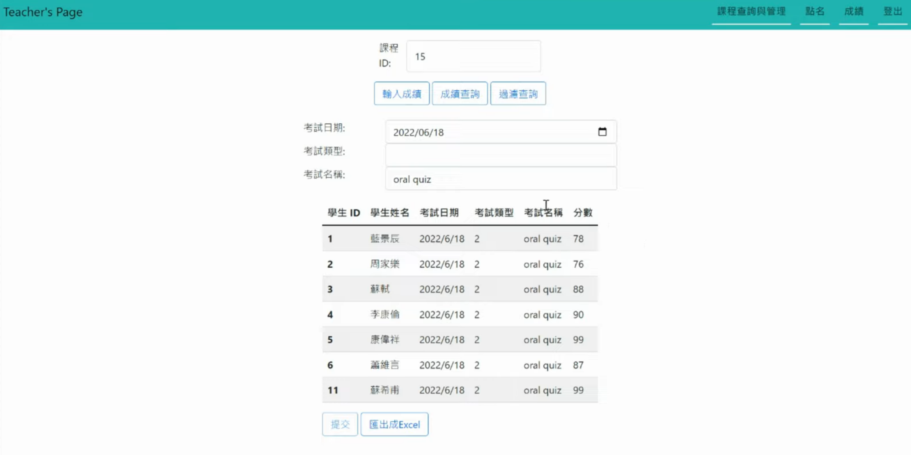

# Database System final Project(using mySQL)

[Demo Video in Chinese](https://www.youtube.com/watch?v=UJ_Pa57Ln88)

## Description
---
This is an student project to learn how to design and implement database system. 
The project is an system that manages students' enrollment, grade and attendance.

## Pictures
---
* login page
  
* Admin page
  
  - Register
  
  - Course
  
  
* Teacher page
  
  
  
  
  
* Student page
  